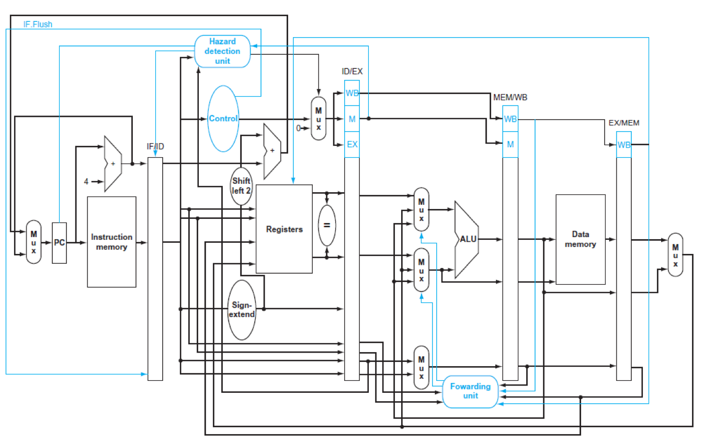

# MIPS Pipelined CPU



## R-type Instruction
```
ADD: Addition
SUB: Subtraction
AND: Logic AND
OR : Logic OR
SLT: Set on less than
```

## I-type Instruction
```
ADDI: Add immediate
LW  : Load word
SW  : Store word
SLTI: Set on less than immediate
BEQ : branch on equal
```

## Other features
```
forwarding, stall, flush
```
